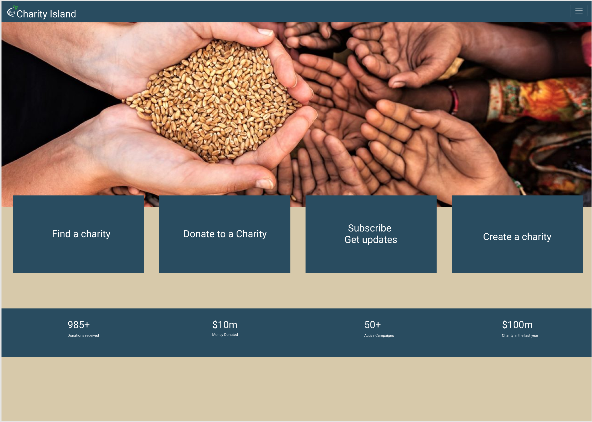
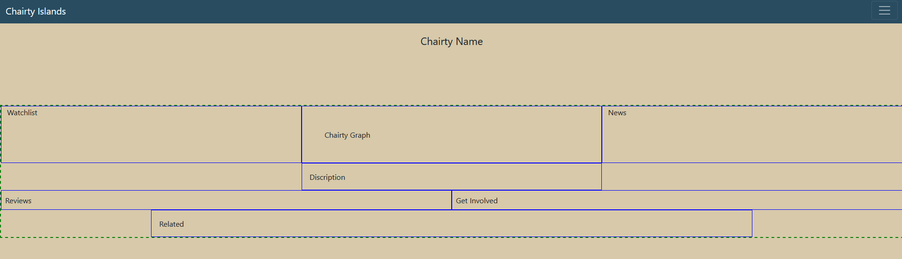

# Front End

[Home](index.md)

### Status

## TODO:

- Login
  - Layout
  - Buttons
  - Accessability
- Search
  Layout
  - Buttons
  - Accessability
- Dashboard
  - Layout
  - Buttons
  - Accessability
- Info
  - Layout
  - Buttons
  - Accessability
- About
  - Layout
  - Buttons
  - Accessability
    -Features
  - implementing a scroll feature for all pages

## Concept

[Search Page](https://www.figma.com/file/ejM9JzxSq7JNJLOYpriYkw/Charity-Islands?node-id=0%3A1)

<iframe style="border: 1px solid rgba(0, 0, 0, 0.1);" width="800" height="450" src="https://www.figma.com/embed?embed_host=share&url=https%3A%2F%2Fwww.figma.com%2Ffile%2FejM9JzxSq7JNJLOYpriYkw%2FCharity-Islands%3Fnode-id%3D0%253A1"allowfullscreen> </iframe>

## Current State

As of Feb 5, 2022

