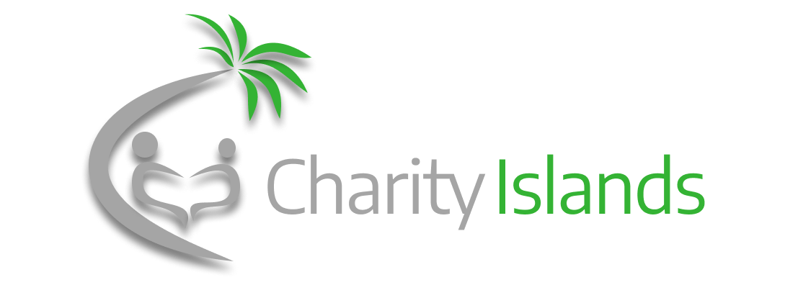

## About

A website that people in the local area of Ventura County can use to become a more generous, kind, philanthropic person all around. Aimed at making a person an overall better person and helping them find charities or community service events in the area of Ventura County. Colleges aim to educate people but don’t really teach people how to be better people to society, so one problem we discussed was students who do want to help and donate to charities or participate in beach clean ups and other communal events don’t really know where to go to find charities or events in the local area of Ventura County.

## Status

### Roadmap

- Feubruary
  - ~~Front End Version 1 February 1st - February 14th~~
  - ~~Front End Version 2 February 15th - February 19th~~
  - ~~Back End Version 1 February 20th - February 28th~~
- March
  - Finish and deploy a workable front-end by March 5
  - Gain feedback and plan out features on Front-End
  - BackEnd and API 
- April
  - Database Schema
- May
  - Presentation/Full Deployment

Further information can be found here:

[Chairty Islands](https://tedejer.github.io/Capstone/)

The site can be seen deployed here:

[WebApp](https://tedejer.github.io/charity-islands/)

## Example Usage

## Links

## Contributing

## Help

Last Revised 3/3/22
