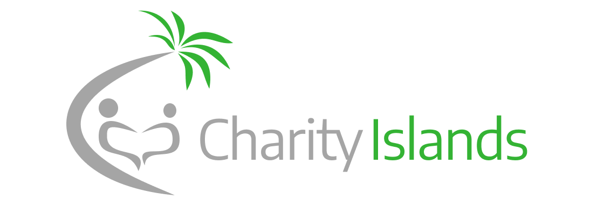

## Contents

- [Front End](FrontEnd.md)
- [Back End](BackEnd.md)
- [API](Api.md)
- [Research](Research.md)

## Our goal

A website that people in the local area of Ventura County can use to become a more generous, kind, philanthropic person all around. Aimed at making a person an overall better person and helping them find charities or community service events in the area of Ventura County. Colleges aim to educate people but don’t really teach people how to be better people to society, so one problem we discussed was students who do want to help and donate to charities or participate in beach clean ups and other communal events don’t really know where to go to find charities or events in the local area of Ventura County.

## Status

### Todo

- Front End (Current)
- Back End
- API
- Database
- Features

### Roadmap

- Feuburary
  - Front End Version 1 February 1st - February 14th
  - Front End Version 2 February 15th - February 19th
  - Back End Version 1 February 20th - February 28th
- March
  - Back End Version 2 March 1st - March 14th
  - Back End Version 3 March 15th - March 22cnd
  - API version 1 March 23rd - March 31st
- April
  - API version 2 April 1st - April 13th
  - Database April 14th - April 27th
  - Features April 28th - April 30th
- May
  - Production May 1st - End of the semester

### General Project Concerns

- Establishing a proper tech stack
- Research necessary tools

## About Us

Ternel E, Jeffery C, Jericho P

We are students from California State University Channel Islands working on our capstone project.

## Misc

[Project Survey](https://forms.gle/MwgDAqQs4hGCz9PQ9)
